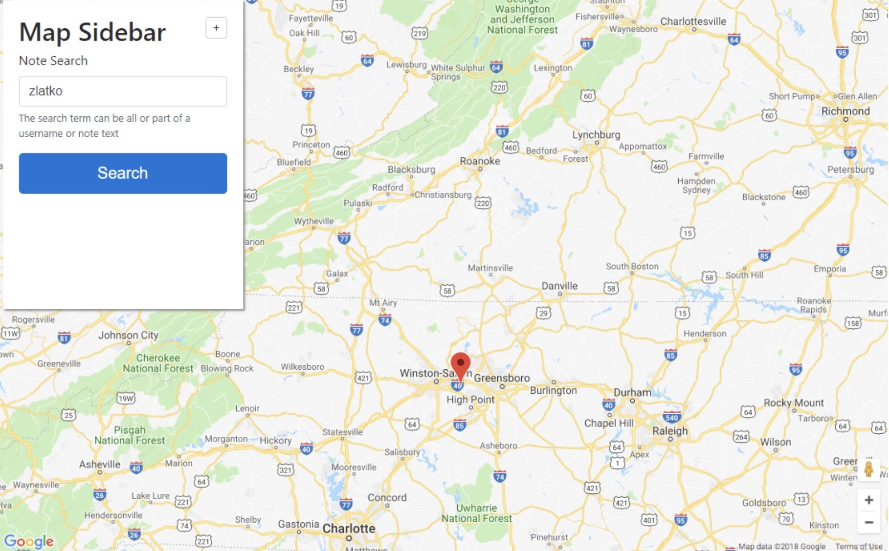
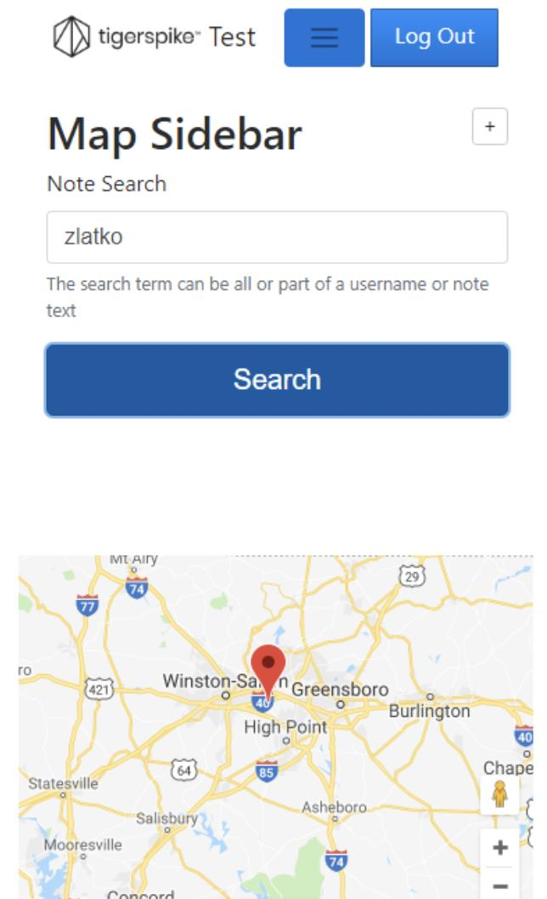

# Tigerspike Test by Zlatko Lakisic

## Application Overview:

This is a single page application  that uses Google Maps API and has a central geo point in the State of Noth Carolina.  Map also uses info windows to show the pin information. The application was developed for Tigerpsike as a test interview project and it can not be used in any other purposes.

## Application Desktop Map Preview

## Application Mobile Preview

## Application Functionalities

This application allows a user to log in and save a note to their current location.

## Technologies used

This is a single page application for which I have used following technologies:

1. Database - MariaDB;
2. Web Service - .NET Core 2.1;
3. UI Components - Angular 2.4 | Typescript;
4. Maps - Google Maps API (https://developers.google.com/maps/documentation/)
   

## How to start the application:
To start this application install necessary .net core 2.1 hostable web package and stup a site in IIS. Point the root of the site to the Publish/WebApplication folder. Create an application within the site and point it to the Publish/WebServices folder.

In order to run this application you will have to have open source server environment node.js. Download the folder and open it in your IDE.  To run this application youy will have to install packet manager for javascript.

* Navigate to the WebApplication and type following command:

	`npm install`

* Navigate to your IIS site in any desired browser